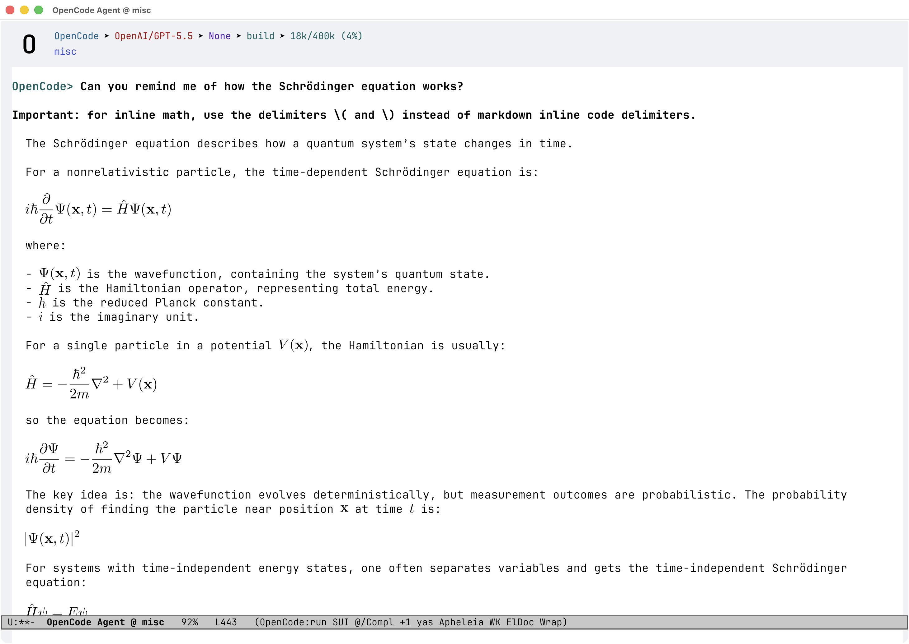

# agent-shell-math-renderer

Render LaTeX math in [`agent-shell`](https://github.com/xenodium/agent-shell)'s
streamed markdown output. Display equations and inline math in an agent's
response are compiled with `latex` → `dvisvgm` and shown as crisp,
theme-matched SVG images — while the original LaTeX stays in the buffer, so
copy and save round-trip renderable source.

[](https://www.youtube.com/watch?v=wGM3xH06Wso)

*▶ [Watch the ~30-second demo](https://www.youtube.com/watch?v=wGM3xH06Wso) (silent). Toward the end the buffer font size is changed and every equation re-scales to match automatically.*

## Highlights

- **Crisp at any size** — equations are vector SVGs, not bitmaps: no pixelation,
  sharp on HiDPI/Retina displays and at every zoom level.
- **Font-matched sizing** — equations render at the buffer's font size, so math
  sits at the same weight as the surrounding text.
- **Rescales with your font** — change the buffer or global font size, or zoom
  (`C-x C-+` / `C-x C--`), and every equation re-sizes to match.
- **Theme-aware** — switch theme or toggle light/dark and the SVGs re-tint to
  the new foreground automatically, with no recompile.
- **Fast** — compilation is asynchronous (hidden behind the agent's streaming)
  and every equation is cached on disk, so repeats are instant.
- **No special agent prompt** — works out of the box; the one thing worth
  telling your agent is to use `\(…\)` for inline math rather than markdown
  inline code, since there is no unambiguous way to tell inline code *meant as
  math* from a literal code span (see the tip under [Usage](#usage)).

## What it renders

| Form | Example | Default |
|------|---------|---------|
| Bracket display math | `\[ E = mc^2 \]` | on |
| Dollar display math | `$$ E = mc^2 $$` | on |
| Fenced math | ```` ```math ```` / ```` ```latex ```` / ```` ```tex ```` blocks | on |
| Inline math | `\(x^2\)` | on |

- **Display delimiters** are matched only at **block level** — the opener must
  start its line and the closer must be flush — which is what makes `$$…$$`
  safe enough to enable by default without tripping on prose or currency.
- **Fenced math** blocks are rewritten to `\[…\]` under the image, so copying a
  rendered equation yields portable LaTeX rather than markdown backticks.
- **Inline `$…$` is intentionally not matched** — a lone `$` is too common in
  prose to detect safely. Use `\(…\)` for inline math.
- Math inside code fences and inline `` `code` `` spans is left untouched.

Images are **theme-aware**: the SVG is compiled once, color-independent, and
tinted to the buffer foreground at display time, so a theme or light/dark
switch re-tints with no recompile. Sizing tracks the buffer font.

## Requirements

- **Emacs 29.1+**
- **[`agent-shell`](https://github.com/xenodium/agent-shell)** (0.57.4 or newer —
  the release that exposes `:inline-code-ranges` to render hooks)
- A **LaTeX toolchain** providing `latex` and `dvisvgm` (e.g. TeX Live /
  MacTeX; `dvisvgm` ships with TeX Live). Without it, equations fall back to a
  bordered placeholder or the raw LaTeX text.
- An Emacs build with **SVG support** for the images (raw LaTeX is shown
  otherwise).

## Installation

The package integrates with `agent-shell` through public API only — no
patching, no advice. With agent-shell's default (in-place) renderer, math
renders automatically once installed; the overlay renderer needs one extra
line — see [Choosing a renderer](#choosing-a-renderer-in-place-vs-overlay).

### `use-package` + `:vc` (Emacs 30+)

The built-in way — no `straight`, no manual `package-vc-install`:

```elisp
(use-package agent-shell-math-renderer
  :vc (:url "https://github.com/alberti42/agent-shell-math-renderer" :rev :newest)
  :after agent-shell
  :config
  (setq agent-shell-math-renderer-enabled t))
```

### `use-package` + `straight`

```elisp
(use-package agent-shell-math-renderer
  :straight (agent-shell-math-renderer
             :type git :host github
             :repo "alberti42/agent-shell-math-renderer")
  :after agent-shell
  :config
  (setq agent-shell-math-renderer-enabled t))
```

### `package-vc-install` (Emacs 29+)

For Emacs 29, where `use-package` has no `:vc` keyword:

```elisp
(package-vc-install "https://github.com/alberti42/agent-shell-math-renderer")
(require 'agent-shell-math-renderer)
(setq agent-shell-math-renderer-enabled t)
```

## Choosing a renderer: in-place vs overlay

`agent-shell` can render an agent's markdown two ways, selected by the
`agent-shell-markdown-render-function` option:

- **In-place** (`agent-shell-markdown-replace-markup`) — agent-shell's default.
  - Rewrites the markup *into* the buffer: `**bold**`, headings, links, list
    bullets, etc. are transformed in place.
  - The actively-developed default; typically the more polished path, and more
    efficient while streaming (it renders incrementally, only the new tail each
    chunk).
  - **Trade-off:** the buffer no longer holds the original markdown, so selecting
    and copying gives back the *stripped* text — not the agent's markdown source.

- **Overlay** (wraps `markdown-overlays-put` from `shell-maker`).
  - Leaves the buffer text as the **raw markdown** and only *overlays* the
    styling on top.
  - So selecting a region and copying (`M-w`) yields **faithful, markdown-valid**
    text you can paste straight into a `.md` file.
  - Re-scans the whole message each streaming chunk rather than incrementally, so
    it does a bit more redundant work (in practice negligible).

In short: pick **in-place** for the nicest rendering, **overlay** if a
copyable, verbatim copy of the agent's output matters more.

### Where this package fits

- **Under the in-place renderer (the default), math just works.** The package
  attaches to agent-shell's render hook automatically — install it, set
  `agent-shell-math-renderer-enabled` to `t`, and you're done. Nothing else to
  configure.
- **The overlay renderer runs no such hook**, so it can't be extended the same
  way. This package therefore ships a drop-in that *is* the overlay renderer
  **plus** math rendering — `agent-shell-math-renderer-markdown-overlays-put`.
  Select it explicitly:

  ```elisp
  (use-package agent-shell-math-renderer
    ;; …install as above…
    :after agent-shell
    :config
    (setq agent-shell-math-renderer-enabled t)
    ;; Overlay renderer (verbatim copy) + math, in one function:
    (setq agent-shell-markdown-render-function
          #'agent-shell-math-renderer-markdown-overlays-put))
  ```

  The drop-in wraps `shell-maker`'s `markdown-overlays-put` directly (not
  agent-shell's own `agent-shell--markdown-overlays-put`, which upstream has
  deprecated), so it keeps working the day that wrapper is removed. If you
  already maintain a custom overlay wrapper, don't use the drop-in — instead
  call `agent-shell-math-renderer-render-overlays` on the value your
  `markdown-overlays-put` call returns.

## Usage

Rendering is gated by a master switch, off by default:

```elisp
(setq agent-shell-math-renderer-enabled t)
```

With it on, math in the agent's responses renders automatically as it streams.
The text renders immediately and the image pops in when the (asynchronous)
compile finishes; the on-disk cache makes every repeat instant.

### Enabling per project

Prefer to render math only in some projects? Leave the global switch off and
enable it per directory. `agent-shell-math-renderer-enabled` is marked safe, so
a `.dir-locals.el` sets it without a confirmation prompt:

```elisp
;; .dir-locals.el at a project root
((agent-shell-mode . ((agent-shell-math-renderer-enabled . t))))
```

The same works for the other side-effect-free options (`-delimiters`,
`-fence-languages`, `-render-inline`, `-font-scale`, …). The toolchain and
preamble options (`-latex-program`, `-dvisvgm-program`, `-preamble`,
`-appended-preamble`, `-cache-directory`) are **not** marked safe — a
`.dir-locals.el` lives inside the repo, and those feed a compiler or run a
program, so Emacs will ask before applying them.

### Tip: tell the agent to use `\(…\)` for inline math

Inline math renders **only** when the agent emits it as `\(…\)`. Two common
alternatives are deliberately left alone:

- **Markdown inline code** (`` `x^2` ``) — code spans are never treated as math,
  so math wrapped in backticks stays literal code. (This is on purpose: it lets
  the agent show a literal `` `\(x\)` `` when it means the source, not the
  equation.)
- **Inline `$…$`** — not matched, because a lone `$` is too common in prose.

Many agents default to wrapping inline math in backticks, which then won't
render. If yours does, add an instruction to its prompt or project rules:

> For inline math, use the delimiters `\(` and `\)` — not markdown inline code.

(Display math — `\[…\]`, `$$…$$`, and ```` ```math ```` fences — is unaffected;
this tip is only about *inline* math.)

### Extra LaTeX packages

Need extra packages in your equations? Append to the preamble — the value is
folded into the cache key, so changing it invalidates stale images
automatically:

```elisp
(setq agent-shell-math-renderer-appended-preamble
      "\\usepackage{physics}
\\usepackage{siunitx}")
```

### Command

- `M-x agent-shell-math-renderer-refresh` — re-render displayed equations for
  the current theme/appearance and font size. Equations already re-render
  lazily on theme, buffer-display, and zoom changes; this forces it now (and
  after a pure global font-size change).

## Customization

All options live in the `agent-shell-math-renderer` customization group
(`M-x customize-group RET agent-shell-math-renderer`).

| Option | Default | Description |
|--------|---------|-------------|
| `agent-shell-math-renderer-enabled` | `nil` | Master switch. Off → the renderer is a no-op. |
| `agent-shell-math-renderer-delimiters` | `(bracket dollar)` | Which display delimiters to recognize: `bracket` (`\[…\]`) and/or `dollar` (`$$…$$`). |
| `agent-shell-math-renderer-fence-languages` | `("math" "latex" "tex")` | Fenced-code languages rendered as display math. `nil` leaves them as code. |
| `agent-shell-math-renderer-render-inline` | `t` | Recognize inline `\(…\)` math. |
| `agent-shell-math-renderer-font-scale` | `1.0` | Equation size relative to the buffer font (`1.0` = match). |
| `agent-shell-math-renderer-appended-preamble` | `""` | Extra LaTeX appended to the base preamble (load packages here). |
| `agent-shell-math-renderer-preamble` | standalone + amsmath/amssymb/xcolor | The base LaTeX preamble. |
| `agent-shell-math-renderer-latex-program` | `"latex"` | Program compiling LaTeX → DVI. |
| `agent-shell-math-renderer-dvisvgm-program` | `"dvisvgm"` | Program converting DVI → SVG. |
| `agent-shell-math-renderer-use-placeholder` | `nil` | Draw the placeholder panel instead of typesetting (also the automatic fallback when the toolchain is missing). |
| `agent-shell-math-renderer-render-on-non-graphic` | `nil` | Compile images even on a non-graphical frame (for daemon setups viewed later in a GUI). |
| `agent-shell-math-renderer-cache-directory` | `nil` | Where SVGs are cached; `nil` uses agent-shell's shared cache. |

The `agent-shell-math-renderer` face styles the raw LaTeX shown on a
non-graphical display (behind the image on a graphical one).

## How it works

- Under the in-place renderer, the package adds
  `agent-shell-math-renderer--render-hook` to
  `agent-shell-markdown-render-functions`; agent-shell's markdown renderer
  calls it once per streaming chunk, after its own passes. Under the overlay
  renderer (which runs no such hook), the drop-in
  `agent-shell-math-renderer-markdown-overlays-put` runs the same rendering on
  the output of `markdown-overlays-put` instead.
- Each equation is compiled by a standalone LaTeX document → DVI (`latex`) →
  SVG (`dvisvgm --no-fonts --exact-bbox --currentcolor`). Compilation is
  **asynchronous** and off the output path, so its latency is masked by the
  agent's own streaming.
- The SVG is **cached on disk** keyed by content (LaTeX + preamble + style), so
  each unique equation compiles at most once, ever, and survives restarts. It
  is color- and font-independent; tint and size are applied cheaply at display
  time.
- The raw LaTeX is kept under the image via a `display` property, so
  selection/copy/save give back the source.

## Gotchas

- **Using the overlay renderer? Keep `markdown-overlays-render-latex` off.** It
  is an experimental `shell-maker` option (off by default — leave it that way)
  that renders LaTeX on the overlay path via Org's `org-format-latex`. If you
  enable it *and* select this package's overlay renderer, both will try to
  render the same equations. There's no need — this package's overlay renderer
  already covers it. (The in-place renderer has no such option, so this concerns
  only the overlay path.)

- **How this package relates to that option.** `markdown-overlays-render-latex`
  grew out of an early experiment
  ([xenodium/agent-shell#117](https://github.com/xenodium/agent-shell/issues/117))
  that previewed equations with Org's `org-format-latex` — a neat, minimal
  approach if you already live in Org. This package takes a standalone route (no
  Org dependency): crisp vector SVGs that match the buffer font, re-tint to the
  current theme with no recompile, are cached on disk, and cover inline `\(…\)`,
  ```` ```math ````/```` ```latex ```` fences, and `$$…$$` / `\[…\]` display
  math. See
  [xenodium/agent-shell#117](https://github.com/xenodium/agent-shell/issues/117)
  for the background and trade-offs.

## Credits

Built on and for [`agent-shell`](https://github.com/xenodium/agent-shell) by
Álvaro Ramírez (xenodium). Rendering approach inspired by karthink's
`org-latex-preview` work, but fully standalone (no Org dependency).

## License

GPL-3.0-or-later. See the header of `agent-shell-math-renderer.el`.
